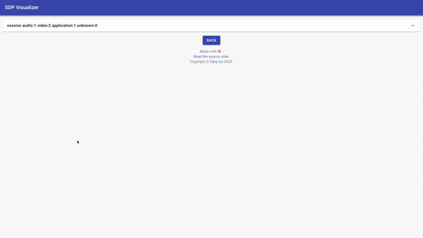

# SDP Visualizer

**TL;DR**: quickly find the section you're looking for and hide the rest.

## SDP

The Session Description Protocol (SDP) is a format for describing multimedia communication sessions for the purposes of session announcement and session invitation ([Wikipedia](https://en.wikipedia.org/wiki/Session_Description_Protocol)). It is the format used for the offer/answer exchange in WebRTC.

A session description can range from 100 to thousands of lines depending on the number of media streams being negotiated. Most of the time, we do not need to read the session description directly because the client should parse the description and fire events as needed. However, in unfornate situations where we have to read the session description to figure out a problem, reading a 4000-line session description is not fun at all.

## What this project does

This project aims to alleviate the pain of reading long session descriptions by allowing you to focus on the part you are actually interested in. The simple web app parses a given session description and breaks it into a tree of collapsible sections.

## Technologies used

- TypeScript
- React
- Material UI.

## License

MIT
